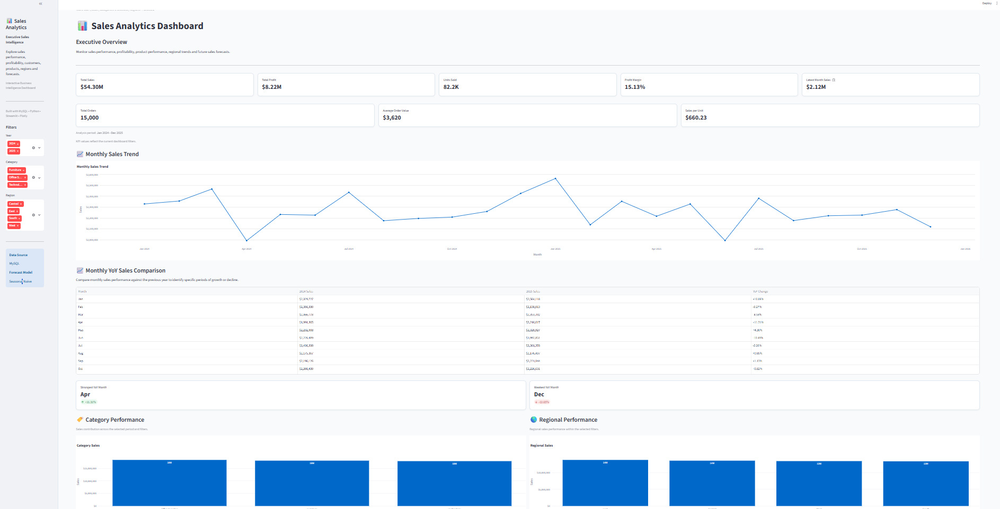

# Enterprise Sales Analytics & Forecasting Platform

An end-to-end business intelligence and sales forecasting application built using **MySQL, Python, Pandas, Streamlit, and Plotly**.

The platform transforms transactional sales data into interactive performance analytics, profitability insights, customer and regional analysis, and a six-month company-wide sales forecast.

> **Dataset note:** The project uses synthetic transactional sales data designed to simulate a realistic business sales environment.

## Dashboard Preview



## Key Results

- **15,000** synthetic sales transactions analyzed
- **$54.30M** total sales across the dataset
- **$8.22M** total profit across the dataset
- **15.13%** overall profit margin
- **6-month** company-wide sales forecast generated
- **5.81% MAPE** achieved by the selected Seasonal Naive forecasting model during validation
- Interactive analysis across **Year, Category, and Region**

---

## Project Overview

The platform analyzes historical sales transactions across multiple business dimensions to answer questions such as:

- How are sales, profit, and margins performing?
- Which categories generate the highest sales and profit?
- Which regions perform strongest and weakest?
- Which products and customers contribute the most revenue?
- How does sales performance change month over month?
- How does the selected year compare with the previous year?
- Which areas represent business opportunities or risks?
- What does the historical sales pattern suggest about the next six months?

The project combines:

- Relational database design
- SQL business intelligence queries
- Python/Pandas data processing
- Interactive Streamlit dashboarding
- Plotly visualizations
- Time-series forecasting
- Model validation
- Data quality validation

---

## Key Features

### Executive Sales Analytics

Interactive KPIs for:

- Total Sales
- Total Profit
- Units Sold
- Profit Margin
- Latest Month Sales
- Total Orders
- Average Order Value
- Sales per Unit

### Interactive Filtering

Users can filter the dashboard by:

- Year
- Category
- Region

The selected filters dynamically update the relevant analytical sections.

### Sales Trend Analysis

- Monthly sales trend
- Historical performance
- Monthly year-over-year comparison
- Category analysis
- Regional analysis

### Profitability Analysis

- Profit by category
- Profit margins
- Sales versus profit relationships
- Identification of weaker-performing business areas

### Product & Customer Analytics

- Top 10 products
- Top customers
- Product-level sales and profitability
- Customer contribution analysis

### Six-Month Sales Forecast

The platform generates a six-month company-wide sales forecast for:

**January 2026 – June 2026**

The forecast includes:

- Forecasted monthly sales
- Forecast versus recent actual performance
- Forecast variance analysis
- Forecast intelligence
- Forecast details
- Business interpretation

### Business Intelligence

The dashboard automatically surfaces:

- Strongest category
- Weakest category
- Strongest region
- Weakest region
- Profitability risks
- Growth opportunities
- Forecast outlook
- Business recommendations

---

## Forecasting Methodology

The forecasting pipeline evaluates multiple time-series approaches using historical monthly sales data and a holdout validation period.

### Models Evaluated

| Model | Validation MAPE |
|---|---:|
| Seasonal Naive | **5.81%** |
| ARIMA(1,1,0) | 9.81% |
| ARIMA(0,1,1) | 9.85% |
| ARIMA(0,1,0) | 10.66% |

The **Seasonal Naive model** was selected because it achieved the lowest validation MAPE among the evaluated approaches.

The final model generates a **six-month company-wide forecast from January 2026 through June 2026**.

### Forecast Design

The forecast is intentionally independent of the dashboard's Year, Category, and Region filters.

This keeps the forecast as a consistent company-level planning baseline rather than presenting a filtered subset as a company-wide forecast.

### Forecast Intelligence

The dashboard compares the forecast against recent historical performance to provide additional business context.

The current forecast average is approximately **2.63% above the average monthly sales of the latest three actual months**, indicating a relatively stable near-term outlook rather than a major expected increase or decline.

---

## Data Quality & Validation

The project includes validation checks across the data, SQL aggregation layer, dashboard calculations, and forecasting pipeline.

### Data Quality Checks

- 15,000 transaction records validated
- No null sales, profit, or order dates
- No duplicate order IDs
- No zero or negative sales values
- No negative quantities
- Discount values validated
- Profit and margin calculations validated
- Delivery-day calculations validated

### Analytical Validation

- Raw transaction totals reconciled against SQL aggregation views
- Global KPI calculations independently validated
- Filtered KPI calculations validated against source data
- Multi-year and cross-filter dashboard behavior tested
- Empty-filter scenarios handled without application crashes
- Forecast file validated for row count, date range, null values, and negative predictions

These checks help ensure that the dashboard's analytical outputs are consistent with the underlying transactional data.

---

## Technology Stack

| Layer | Technology |
|---|---|
| Database | MySQL |
| Data Processing | Python, Pandas, NumPy |
| Forecasting | Statsmodels, Scikit-learn |
| Dashboard | Streamlit |
| Visualization | Plotly |
| SQL Analytics | MySQL Views & Queries |
| Configuration | Python Dotenv |
| Environment | Python Virtual Environment |

---

## Project Architecture

```text
                         Raw Sales Data
                              |
                              v
                       Data Cleaning / ETL
                              |
                              v
                            MySQL
                              |
                              v
                          sales_raw
                              |
                +-------------+-------------+
                |             |             |
                v             v             v
            SQL Views    Business SQL   Validation
                |
                v
          Python / Pandas
                |
          +-----+------+
          |            |
          v            v
      Analytics    Forecasting
          |            |
          |       Model Evaluation
          |            |
          |            v
          |      Seasonal Naive
          |            |
          +-----+------+
                |
                v
        Streamlit Dashboard
                |
        +-------+----------------------+
        |                              |
        v                              v
 Interactive BI              Forecast Intelligence
        |
        v
 Business Recommendations
